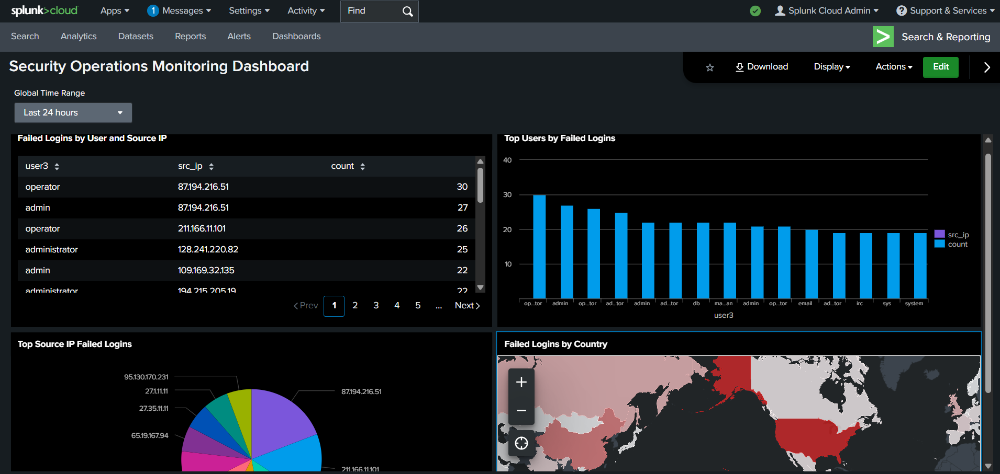

# Splunk Security Monitoring Dashboard

## Overview
This project demonstrates a custom Splunk dashboard built to visualize authentication activity and detect potential security anomalies. It includes regex-based field extractions, geographic mapping of failed logins, and data filtering.

## Tools & Technologies
- Splunk Cloud Free
- SPL (Search Processing Language)
- Regex-based field extractions
- iplocation command (geolocation)
- Choropleth map and bar chart visualizations

## Features
- Extracts `user` and `login_status` using Field Extraction configurations
- Maps failed login attempts by country using `iplocation`
- Lists top users and source IPs with failed authentication attempts

## Dashboard Preview


## Example SPL Searches
```spl
source="tutorialdata.zip:*" login_status="Failed password"
| iplocation src_ip
| stats count by Country
| geom geo_countries featureIdField=Country 
